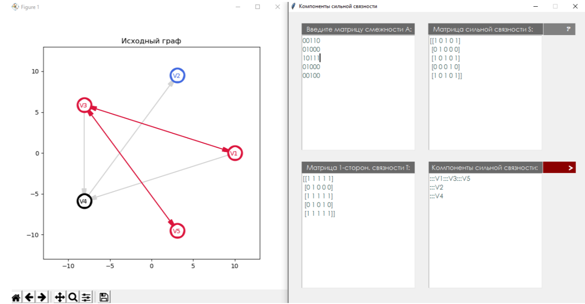
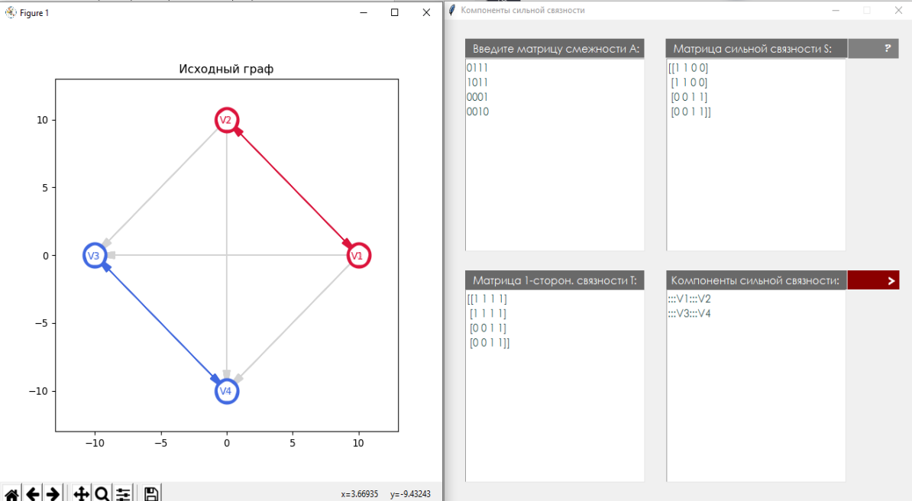

# GraphTheory_StronglyConnectedComponents

Программа для поиска компонент сильной связности в заданном матрицей графе. 
Подробное описание решения задачи находится в .pdf - файле.

Используемые библиотеки - matplotlib, tkinter.

Примеры работы программы:

